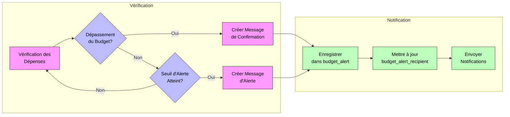

# Messsage d'alerts

Pour implémenter les messages d'alerte et de confirmation, voici les modifications à apporter à la base de données :

```sql
-- Table pour stocker les alertes
CREATE TABLE IF NOT EXISTS `budget_alert` (
    `alert_id` int unsigned NOT NULL AUTO_INCREMENT,
    `budget_id` int unsigned NOT NULL,
    `type` enum('thre+shold', 'exceeded') NOT NULL,
    `message` text NOT NULL,
    `is_read` tinyint(1) NOT NULL DEFAULT 0,
    `created_at` timestamp NULL DEFAULT CURRENT_TIMESTAMP,
    PRIMARY KEY (`alert_id`),
    KEY `budget_id` (`budget_id`),
    CONSTRAINT `budget_alert_ibfk_1` FOREIGN KEY (`budget_id`) REFERENCES `budget` (`budget_id`)
) ENGINE=InnoDB DEFAULT CHARSET=utf8mb4 COLLATE=utf8mb4_0900_ai_ci;

-- Table pour stocker les destinataires des alertes
CREATE TABLE IF NOT EXISTS `budget_alert_recipient` (
    `alert_id` int unsigned NOT NULL,
    `user_id` int NOT NULL,
    `notification_status` enum('pending', 'sent', 'read') NOT NULL DEFAULT 'pending',
    PRIMARY KEY (`alert_id`, `user_id`),
    KEY `user_id` (`user_id`),
    CONSTRAINT `budget_alert_recipient_ibfk_1` FOREIGN KEY (`alert_id`) REFERENCES `budget_alert` (`alert_id`),
    CONSTRAINT `budget_alert_recipient_ibfk_2` FOREIGN KEY (`user_id`) REFERENCES `users` (`id`)
) ENGINE=InnoDB DEFAULT CHARSET=utf8mb4 COLLATE=utf8mb4_0900_ai_ci;

-- Vue pour suivre les dépassements de budget
CREATE VIEW budget_exceeded_view AS
SELECT 
    b.budget_id,
    b.customer_id,
    b.amount as budget_amount,
    COALESCE(SUM(e.amount), 0) as total_expenses,
    b.currency,
    (COALESCE(SUM(e.amount), 0) / b.amount * 100) as percentage_used
FROM budget b
LEFT JOIN expense e ON b.budget_id = e.budget_id
GROUP BY b.budget_id
HAVING COALESCE(SUM(e.amount), 0) > b.amount;
```

Voici le flux de traitement des alertes :



Le diagramme ci-dessus illustre le processus de gestion des alertes avec :

- Les boîtes roses représentent les actions principales
- Les losanges bleus représentent les points de décision
- Les boîtes vertes représentent les opérations de stockage et notification

Le processus se divise en deux phases :

1. **Phase de Vérification** (gauche) :
   - Vérification continue des dépenses
   - Évaluation du dépassement du budget
   - Vérification du seuil d'alerte

2. **Phase de Notification** (droite) :
   - Enregistrement des alertes dans la base de données
   - Mise à jour du statut des destinataires
   - Envoi des notifications

Voici les procédures stockées pour gérer ces alertes :

```sql
DELIMITER //

CREATE PROCEDURE sp_check_budget_thresholds()
BEGIN
    DECLARE done INT DEFAULT FALSE;
    DECLARE budget_id INT;
    DECLARE customer_id INT;
    DECLARE budget_amount DECIMAL(15,2);
    DECLARE total_expenses DECIMAL(15,2);
    DECLARE threshold_percentage DECIMAL(5,2);
    DECLARE threshold_alert_id INT;
    
    DECLARE budget_cursor CURSOR FOR
        SELECT 
            b.budget_id,
            b.customer_id,
            b.amount,
            COALESCE(SUM(e.amount), 0),
            bs.notification_threshold
        FROM budget b
        LEFT JOIN expense e ON b.budget_id = e.budget_id
        LEFT JOIN budget_settings bs ON b.customer_id = bs.customer_id
        GROUP BY b.budget_id
        HAVING COALESCE(SUM(e.amount), 0) > 0;
    
    DECLARE CONTINUE HANDLER FOR NOT FOUND SET done = TRUE;

    OPEN budget_cursor;

    read_loop: LOOP
        FETCH budget_cursor INTO budget_id, customer_id, budget_amount, total_expenses, threshold_percentage;
        
        IF done THEN
            LEAVE read_loop;
        END IF;

        -- Vérifier le dépassement du budget
        IF total_expenses > budget_amount THEN
            INSERT INTO budget_alert (budget_id, type, message)
            VALUES (
                budget_id,
                'exceeded',
                CONCAT('Dépassement de budget détecté pour le budget #', budget_id, 
                       '. Montant dépensé: ', total_expenses, 
                       '. Budget initial: ', budget_amount)
            );
        -- Vérifier le seuil d'alerte
        ELSEIF threshold_percentage IS NOT NULL THEN
            DECLARE current_percentage DECIMAL(5,2);
            SET current_percentage = (total_expenses / budget_amount * 100);
            
            IF current_percentage >= threshold_percentage THEN
                INSERT INTO budget_alert (budget_id, type, message)
                VALUES (
                    budget_id,
                    'threshold',
                    CONCAT('Seuil d\'alerte atteint pour le budget #', budget_id, 
                           '. ', current_percentage, '% du budget utilisé')
                );
            END IF;
        END IF;
    END LOOP;

    CLOSE budget_cursor;
END//

CREATE PROCEDURE sp_notify_alert_recipients()
BEGIN
    INSERT INTO budget_alert_recipient (alert_id, user_id)
    SELECT 
        ba.alert_id,
        u.id
    FROM budget_alert ba
    JOIN budget b ON ba.budget_id = b.budget_id
    JOIN customer c ON b.customer_id = c.customer_id
    JOIN user_roles ur ON c.user_id = ur.user_id
    JOIN users u ON ur.user_id = u.id
    WHERE ba.is_read = 0
    AND ur.role_id IN (1, 2);  -- ROLE_MANAGER, ROLE_EMPLOYEE
END//

DELIMITER ;
```

Pour activer ces fonctionnalités, ajoutez cette tâche planifiée :

```sql
CREATE EVENT check_budget_alerts
ON SCHEDULE EVERY 1 HOUR
DO
CALL sp_check_budget_thresholds();
CALL sp_notify_alert_recipients();
```

Ces modifications permettent :

1. **Messages d'alerte** :
   - Détection automatique du seuil d'alerte
   - Messages personnalisés avec les montants
   - Historique des alertes

2. **Messages de confirmation** :
    - Notification immédiate en cas de dépassement
    - Comparaison claire entre budget et dépenses
    - Suivi du statut des notifications

3. **Gestion des destinataires** :
    - Envoi ciblé aux managers et employés concernés
    - Suivi de la lecture des notifications
    - Intégration avec le système de rôles existant

Le système vérifie automatiquement les budgets toutes les heures et génère les alertes appropriées selon les seuils définis dans la table `budget_settings`.
