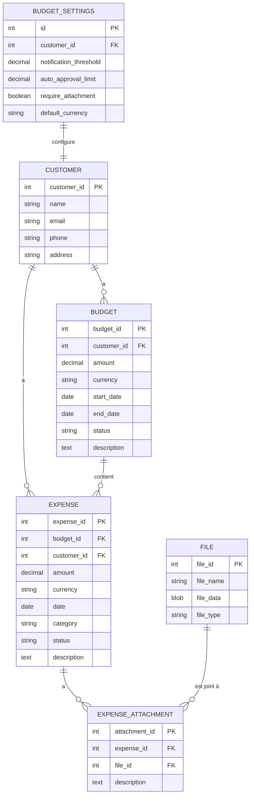

# Gestion de budget et depenses

Pour intégrer la gestion de budget et dépenses dans votre CRM, voici les tables à ajouter :

```sql
CREATE TABLE IF NOT EXISTS `budget` (
    `budget_id` int unsigned NOT NULL AUTO_INCREMENT,
    `customer_id` int unsigned NOT NULL,
    `amount` decimal(15,2) NOT NULL,
    `currency` varchar(3) NOT NULL DEFAULT 'EUR',
    `start_date` date NOT NULL,
    `end_date` date,
    `status` enum('active', 'inactive', 'archived') NOT NULL DEFAULT 'active',
    `description` text,
    `created_at` timestamp NULL DEFAULT CURRENT_TIMESTAMP,
    `updated_at` timestamp NULL DEFAULT CURRENT_TIMESTAMP ON UPDATE CURRENT_TIMESTAMP,
    PRIMARY KEY (`budget_id`),
    KEY `customer_id` (`customer_id`),
    CONSTRAINT `budget_ibfk_1` FOREIGN KEY (`customer_id`) REFERENCES `customer` (`customer_id`)
) ENGINE=InnoDB DEFAULT CHARSET=utf8mb4 COLLATE=utf8mb4_0900_ai_ci;

CREATE TABLE IF NOT EXISTS `expense` (
    `expense_id` int unsigned NOT NULL AUTO_INCREMENT,
    `budget_id` int unsigned,
    `customer_id` int unsigned NOT NULL,
    `amount` decimal(15,2) NOT NULL,
    `currency` varchar(3) NOT NULL DEFAULT 'EUR',
    `date` date NOT NULL,
    `category` varchar(100) NOT NULL,
    `description` text,
    `status` enum('pending', 'approved', 'rejected') NOT NULL DEFAULT 'pending',
    `created_at` timestamp NULL DEFAULT CURRENT_TIMESTAMP,
    `updated_at` timestamp NULL DEFAULT CURRENT_TIMESTAMP ON UPDATE CURRENT_TIMESTAMP,
    PRIMARY KEY (`expense_id`),
    KEY `budget_id` (`budget_id`),
    KEY `customer_id` (`customer_id`),
    CONSTRAINT `expense_ibfk_1` FOREIGN KEY (`budget_id`) REFERENCES `budget` (`budget_id`),
    CONSTRAINT `expense_ibfk_2` FOREIGN KEY (`customer_id`) REFERENCES `customer` (`customer_id`)
) ENGINE=InnoDB DEFAULT CHARSET=utf8mb4 COLLATE=utf8mb4_0900_ai_ci;

CREATE TABLE IF NOT EXISTS `expense_attachment` (
    `attachment_id` int unsigned NOT NULL AUTO_INCREMENT,
    `expense_id` int unsigned NOT NULL,
    `file_id` int NOT NULL,
    `description` text,
    `created_at` timestamp NULL DEFAULT CURRENT_TIMESTAMP,
    PRIMARY KEY (`attachment_id`),
    KEY `expense_id` (`expense_id`),
    KEY `file_id` (`file_id`),
    CONSTRAINT `expense_attachment_ibfk_1` FOREIGN KEY (`expense_id`) REFERENCES `expense` (`expense_id`),
    CONSTRAINT `expense_attachment_ibfk_2` FOREIGN KEY (`file_id`) REFERENCES `file` (`file_id`)
) ENGINE=InnoDB DEFAULT CHARSET=utf8mb4 COLLATE=utf8mb4_0900_ai_ci;

CREATE TABLE IF NOT EXISTS `budget_settings` (
    `id` int unsigned NOT NULL AUTO_INCREMENT,
    `customer_id` int unsigned NOT NULL,
    `notification_threshold` decimal(5,2) DEFAULT NULL,
    `auto_approval_limit` decimal(15,2) DEFAULT NULL,
    `require_attachment` tinyint(1) DEFAULT 0,
    `default_currency` varchar(3) DEFAULT 'EUR',
    `created_at` timestamp NULL DEFAULT CURRENT_TIMESTAMP,
    PRIMARY KEY (`id`),
    KEY `customer_id` (`customer_id`),
    CONSTRAINT `budget_settings_ibfk_1` FOREIGN KEY (`customer_id`) REFERENCES `customer` (`customer_id`)
) ENGINE=InnoDB DEFAULT CHARSET=utf8mb4 COLLATE=utf8mb4_0900_ai_ci;
```

Voici la structure des relations entre les tables :



Le diagramme ci-dessus illustre les relations entre les tables avec les notations suivantes :

- `||--o{` signifie "un-à-plusieurs" : par exemple, un CUSTOMER peut avoir plusieurs BUDGET
- Les flèches montrent la direction des relations
- Les champs PK (Primary Key) et FK (Foreign Key) indiquent les clés de liaison entre les tables

Cette structure permet plusieurs fonctionnalités clés :

1. **Gestion des budgets** :
   - Création de budgets pour chaque client
   - Suivi des dépenses par rapport au budget
   - Alertes automatiques basées sur les seuils

2. **Gestion des dépenses** :
   - Enregistrement des dépenses avec pièces jointes
   - Catégorisation et suivi temporel
   - Validation et approbation des dépenses

3. **Configuration personnalisée** :
   - Paramètres par client (seuils, devises, exigences)
   - Gestion des notifications
   - Politiques d'approbation flexibles

Pour utiliser efficacement ce système, vous pouvez créer des vues pour les rapports courants :

```sql
CREATE VIEW customer_budget_summary AS
SELECT 
    c.customer_id,
    c.name,
    b.budget_id,
    b.amount as budget_amount,
    COALESCE(SUM(e.amount), 0) as total_expenses,
    b.currency,
    b.status as budget_status
FROM customer c
LEFT JOIN budget b ON c.customer_id = b.customer_id
LEFT JOIN expense e ON b.budget_id = e.budget_id
GROUP BY c.customer_id, b.budget_id;
```

Cette structure est conçue pour être :

- Flexible : adaptation facile aux besoins spécifiques
- Évolutive : possibilité d'ajouter de nouvelles fonctionnalités
- Performante : index appropriés pour les requêtes fréquentes
- Intégrée : cohérence avec les tables existantes du CRM
