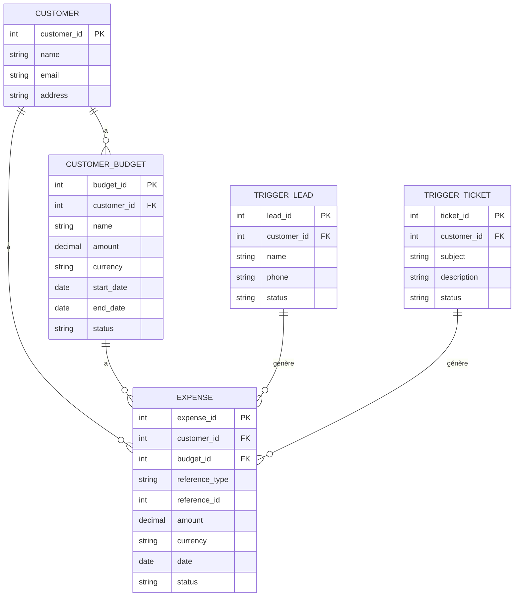

# Gestion de bufgets et depenses d'un client

Pour intégrer la gestion de budget et dépenses dans votre CRM, voici les schémas SQL nécessaires :

```sql
    - Table pour gérer les budgets des clients
CREATE TABLE IF NOT EXISTS `customer_budget` (
    `budget_id` int unsigned NOT NULL AUTO_INCREMENT,
    `customer_id` int unsigned NOT NULL,
    `name` varchar(255) NOT NULL,
    `amount` decimal(15,2) NOT NULL,
    `currency` varchar(3) NOT NULL DEFAULT 'EUR',
    `start_date` date NOT NULL,
    `end_date` date,
    `status` enum('active', 'inactive', 'closed') NOT NULL DEFAULT 'active',
    `description` text,
    `created_at` timestamp NOT NULL DEFAULT CURRENT_TIMESTAMP,
    `updated_at` timestamp NOT NULL DEFAULT CURRENT_TIMESTAMP ON UPDATE CURRENT_TIMESTAMP,
    PRIMARY KEY (`budget_id`),
    KEY `customer_id` (`customer_id`),
    CONSTRAINT `fk_budget_customer` FOREIGN KEY (`customer_id`) REFERENCES `customer` (`customer_id`)
) ENGINE=InnoDB DEFAULT CHARSET=utf8mb4 COLLATE=utf8mb4_0900_ai_ci;

    - Table pour gérer les dépenses
CREATE TABLE IF NOT EXISTS `expense` (
    `expense_id` int unsigned NOT NULL AUTO_INCREMENT,
    `customer_id` int unsigned NOT NULL,
    `budget_id` int unsigned,
    `reference_type` enum('ticket', 'lead') NOT NULL,
    `reference_id` int unsigned NOT NULL,
    `amount` decimal(15,2) NOT NULL,
    `currency` varchar(3) NOT NULL DEFAULT 'EUR',
    `description` text,
    `date` date NOT NULL,
    `status` enum('pending', 'approved', 'rejected') NOT NULL DEFAULT 'pending',
    `created_at` timestamp NOT NULL DEFAULT CURRENT_TIMESTAMP,
    `updated_at` timestamp NOT NULL DEFAULT CURRENT_TIMESTAMP ON UPDATE CURRENT_TIMESTAMP,
    PRIMARY KEY (`expense_id`),
    KEY `customer_id` (`customer_id`),
    KEY `budget_id` (`budget_id`),
    KEY `reference_type` (`reference_type`),
    KEY `reference_id` (`reference_id`),
    CONSTRAINT `fk_expense_customer` FOREIGN KEY (`customer_id`) REFERENCES `customer` (`customer_id`),
    CONSTRAINT `fk_expense_budget` FOREIGN KEY (`budget_id`) REFERENCES `customer_budget` (`budget_id`)
) ENGINE=InnoDB DEFAULT CHARSET=utf8mb4 COLLATE=utf8mb4_0900_ai_ci;

    - Vue pour le suivi des dépenses par budget
CREATE VIEW `budget_expenses_view` AS
SELECT 
    cb.budget_id,
    cb.customer_id,
    cb.name as budget_name,
    cb.amount as budget_amount,
    COALESCE(SUM(e.amount), 0) as total_expenses,
    cb.amount   - COALESCE(SUM(e.amount), 0) as remaining_amount,
    (COALESCE(SUM(e.amount), 0) / cb.amount * 100) as utilization_percentage
FROM customer_budget cb
LEFT JOIN expense e ON cb.budget_id = e.budget_id
GROUP BY cb.budget_id;
```

Voici la structure complète du système avec les nouvelles tables et leurs relations :



Explications des relations et fonctionnalités :

1. **Relations entre les tables** :
    - Un client (CUSTOMER) peut avoir plusieurs budgets (CUSTOMER_BUDGET)
    - Un budget peut être lié à plusieurs dépenses (EXPENSE)
    - Les dépenses peuvent être liées soit à un ticket (TRIGGER_TICKET), soit à un lead (TRIGGER_LEAD)
    - Chaque dépense est toujours associée à un client, même si elle n'est pas liée à un budget spécifique

2. **Vue budget_expenses_view** :
    - Permet de suivre facilement l'utilisation des budgets
    - Calcule automatiquement le montant restant et le pourcentage d'utilisation
    - Facilite la création de rapports et de tableaux de bord

3. **Cas d'utilisations** :
   - Création d'un budget pour un client :

```sql
INSERT INTO customer_budget (customer_id, name, amount, start_date, end_date)
VALUES (1, 'Budget Marketing 2025', 10000.00, '2025-01-01', '2025-12-31');
```

- Enregistrement d'une dépense liée à un ticket :

```sql
INSERT INTO expense (customer_id, budget_id, reference_type, reference_id, amount, date)
VALUES (1, 1, 'ticket', 123, 500.00, '2025-03-22');
```

Cette structure permet une gestion flexible et complète des budgets et dépenses, tout en maintenant l'intégrité des données et facilitant les analyses financières.
