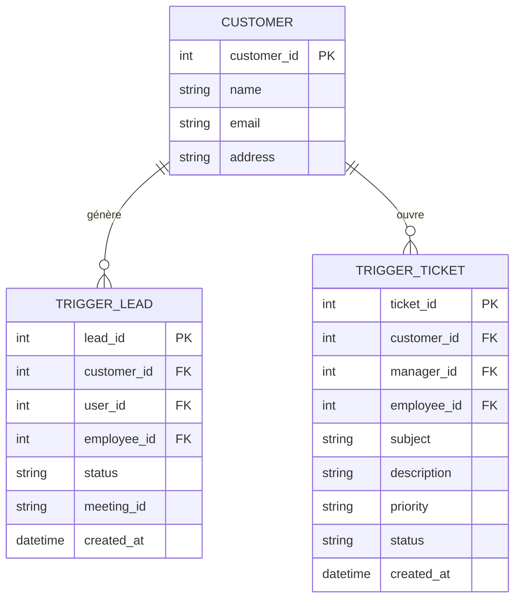

# Comprehension de lead et ticket

## Explication

Dans votre structure de base de données CRM, les tables `trigger_lead` et `trigger_ticket` sont des composants essentiels qui gèrent les interactions avec vos clients potentiels et existants.

### trigger_lead

La table `trigger_lead` représente un prospect ou une opportunité commerciale potentielle. Elle contient les informations essentielles pour suivre les leads :

- `customer_id` : Lien avec le client potentiel
- `user_id` : L'employé responsable du suivi
- `employee_id` : L'employé assigné au lead
- `status` : État du lead (nouveau, en cours, converti, etc.)
- `meeting_id` : Référence aux réunions planifiées
- `google_drive` : Intégration avec Google Drive pour les documents

### trigger_ticket

La table `trigger_ticket` gère les demandes de support ou les problèmes signalés par les clients. Elle contient :

- `customer_id` : Lien avec le client
- `manager_id` : Le gestionnaire du ticket
- `employee_id` : L'employé assigné au ticket
- `subject` : Objet de la demande
- `description` : Détails de la demande
- `priority` : Niveau de priorité
- `status` : État du ticket (ouvert, en cours, résolu)



Ces tables fonctionnent ensemble dans un flux de travail CRM typique :

1. **Gestion des Leads** (`trigger_lead`) :
   - Un nouveau prospect s'intéresse à vos services
   - Un lead est créé avec son statut initial
   - Les réunions et interactions sont suivies
   - Le lead peut évoluer vers un client potentiel

2. **Gestion des Tickets** (`trigger_ticket`) :
   - Un client ouvre une demande de support
   - Le ticket est assigné à un employé
   - Le statut et la priorité sont gérés
   - Les interactions sont documentées

Exemple pratique :

```sql
-- Création d'un nouveau lead
INSERT INTO trigger_lead (customer_id, user_id, employee_id, status, meeting_id)
VALUES (1, 1, 2, 'new', 'meet_123');

-- Création d'un ticket de support
INSERT INTO trigger_ticket (customer_id, manager_id, employee_id, subject, description)
VALUES (1, 1, 2, 'Problème de connexion', 'Impossible de se connecter au système');
```

Ces tables sont conçues pour travailler ensemble efficacement, permettant de suivre l'ensemble du cycle de vie d'un client, de la prospection initiale (via `trigger_lead`) jusqu'au support client (via `trigger_ticket`).
